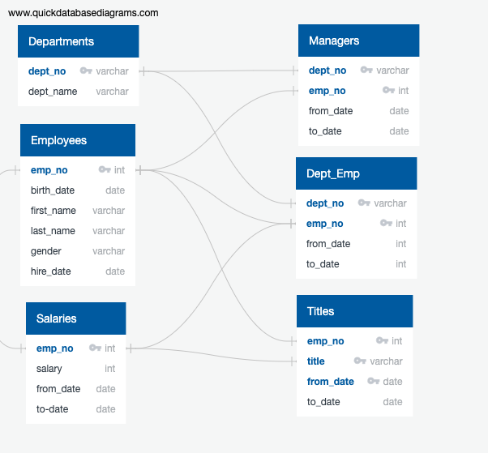

# Pewlett_Hackard_Analysis

## Overview

The purpose of this analysis is to review the workforce at Pewlett Hackard that is nearing retirement. I have been asked to identify employees who are most likely to retire soon by their title and employees who could transition to a part time mentorship program compared to just retiring. I used PostgreSQL to complete my analysis.

### Current Storage of Data

Pewlett Hackard currently stores their employee data in 6 different csv files. Here is the entity relationship diagram of those datasets.

## Results

### Retiring Pewlett Hackard Employees by Titles

The current criteria for this analysis is to find employees born between 1952 and 1955. The major takeaways from this analysis are:

1. There are 90,399 employees who are likely to retire soon
2. 57,668 employees are senior level employees
3. 45,397 employees are engineers
4. 40,497 employees are staff
5. Only 2 managers need to be replaced

### Mentorship Eligibility

The current criteria for this analysis is to find employees born in 1965 and have current roles with no termination dates. The major takeaways from this analysis are:

1. There are 1,550 employees eligible for the mentorship program
2. 741 employees are senior level employees
3. 748 employees are engineers
4. 724 employees are staff
5. There are no managers eligible for this program based on the current criteria

## Summary

Looking at both of these analyses, we can see that of the 90,399 potential spaces that need to be filled due to retirement, there are only 1,550 employees currently eligible to mentor new employees to fill those positions. That means there is one mentor for every 58 new employees. More importantly, there is only 741 senior level employees eligible to mentor 57,668 vacancies. That means there is one senior level mentor for every 77 new senior level employees.

By adjusting the criteria for the mentorship program to employees born between 1962 and 1965 those numbers drop to one mentor for every 1.6 new employees and one senior level mentor for every 2.3 new senior level employees. By opening up the peramiters of eligible employees this program is very likely to succeed. More employees will be open to mentoring if they are only mentoring 2 to 3 people instead of 50+ people. Also, new employees will gain more from one on one mentoring compared to group mentoring that would likely happen in the first situation. While not everyone will want to praticipate in this program, the more employees that participate the better.

